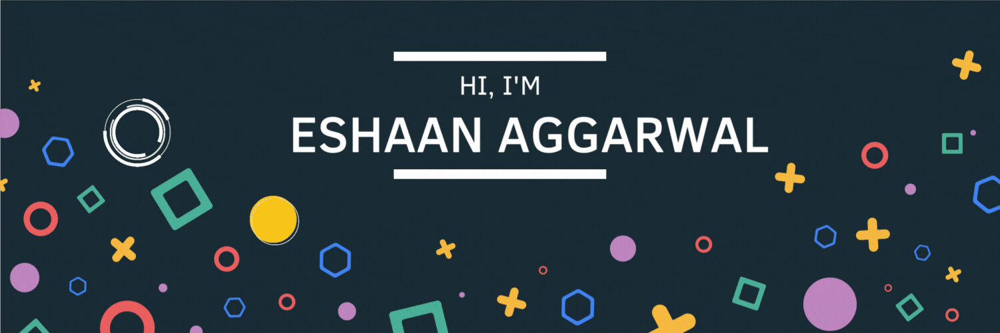

 

&nbsp;

&nbsp;

 

### 
I'm [Eshaan Aggarwal](https://eshaanagg.netlify.app/), a student, and developer from India. 🚀

- 💻 I am a Computer Science and Engineering undergraduate student at the Indian Institute of Technology BHU (Varanasi) pursuing a Bachelor of Technology in my second year.

- 🐱 I have a keen interest in Open Source and Web Development.

- 🌱 I’m currently learning Next.js and Django.

- ❓ Ask me about anything related to MEVN stack and related technologies.

- 📫 Reach me at eshaanagg@gmail.com

- 📄 Know about my experiences [here](https://www.canva.com/design/DAFKZUTun1c/v9PVUxOj-KIEn7MPmg2jEg/view?utm_content=DAFKZUTun1c&utm_campaign=designshare&utm_medium=link&utm_source=publishsharelink)

- ⚡ Fun fact: My favorite team name for Python competitions is `Indented Pun`.😚

 

## My Skill Set

<table><tr><td valign="top" width="33%">

### Frontend

  
  
  
  
  
  

</td><td valign="top" width="33%">

### Backend

  
  
  
  
  
  
  
  

</td><td valign="top" width="33%">

### DevOps

  
  
  
  
  
  
  

</td></tr></table>

 

## Connect with me

  

 

<h2>Github Stats</h2>
  
 
 
 

 

## Recent Activity :zap:

<!--START_SECTION:activity-->

1. 🗣 Commented on [#235](https://github.com/fedimint/ui/issues/235#issuecomment-1766231486) in [fedimint/ui](https://github.com/fedimint/ui)
2. ❗ Opened issue [#220](https://github.com/peter-evans/dockerhub-description/issues/220) in [peter-evans/dockerhub-description](https://github.com/peter-evans/dockerhub-description)
3. ❗ Opened issue [#235](https://github.com/fedimint/ui/issues/235) in [fedimint/ui](https://github.com/fedimint/ui)
4. 💪 Opened PR [#234](https://github.com/fedimint/ui/pull/234) in [fedimint/ui](https://github.com/fedimint/ui)
5. 🗣 Commented on [#23](https://github.com/EshaanAgg/LFXMM-Backend/pull/23#issuecomment-1764439708) in [EshaanAgg/LFXMM-Backend](https://github.com/EshaanAgg/LFXMM-Backend)
<!--END_SECTION:activity-->
