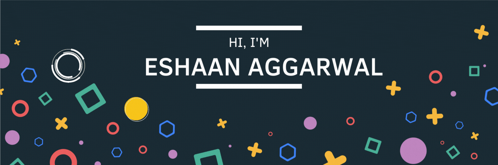

 

&nbsp;

&nbsp;

 

Hi! I'm [Eshaan Aggarwal](https://eshaanagg.netlify.app/) 🚀

I am a Computer Science and Engineering graduate from the Indian Institute of Technology, BHU (Varanasi). I have a keen interest in Open Source and all things development.

Listen to me ramble on [X](https://twitter.com/eshaanagg) or [LinkedIn](https://linkedin.com/in/eshaan-aggarwal).

<h2>Github Stats</h2>
  
 

 
